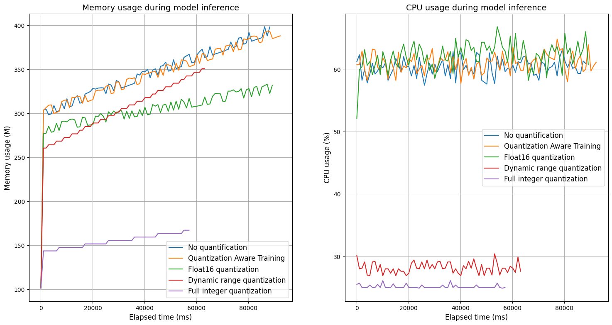
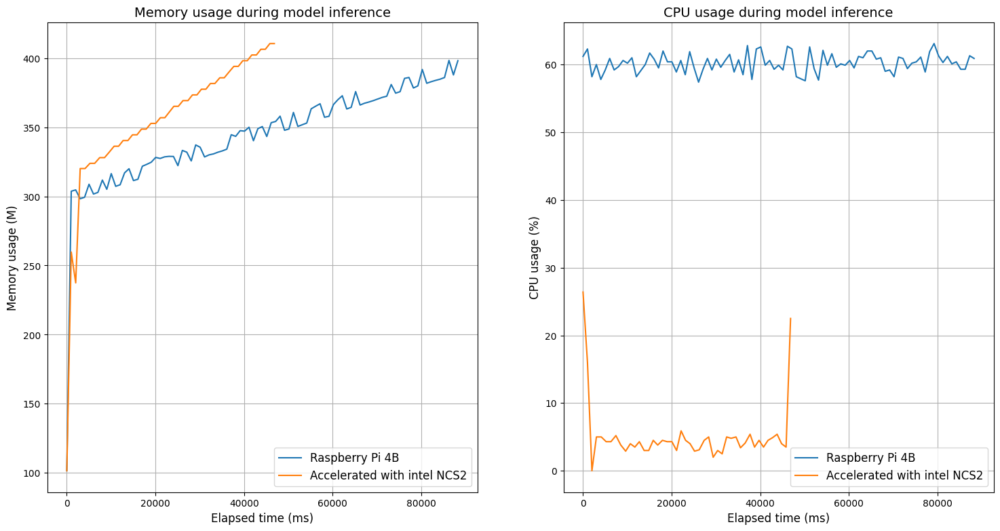

<h2 align=center>CSCI 6709 - Software-Defined Networking</h2>

<h5 align=center>Project : Performance Evaluation of ML Models in Resource Constraint Devices </h5>
<h5 align=center>Performance of different models of handwritten digit recognition dataset on different edge devices</h5>


This experiment aims to develop multiple neural network models for the MNIST dataset using TensorFlow, and then optimize and fine-tune them to obtain the best model. The models are evaluated on a test dataset, and a confusion matrix and classification report are generated.

To make the models run better on edge devices, we optimize them with pruning, quantization, and other techniques. The models are then converted to TensorFlow Lite models and OpenVINO IR models and tested on hardware platforms such as Raspberry Pi, Intel Neural Compute Stick, and smart NICs. The models read the transformed test dataset and perform inference, while the run status and results are recorded in numpy binary format files. These files are imported into a computer to generate reports.

Finally, all experimental results are analyzed, and graphs are created to summarize the findings.

**MNIST_Model Contents:**

This directory contains various files related to the MNIST model, including the following:

| Files or directories | Descriptions |
| :------------------- | ------------ |
| `MNIST_model.ipynb`  |A jupyter notebook file containing the model generation, data generation, and evaluation of the model.|
|`model_run.py`|A Python program for loading test data and tflite or IR  model on a Raspberry Pi 3 or 4.|
|`run_ir.sh`| A shell script runs on the Raspberry Pi OS to call the Python program that loads the OpenVINO IR model and generates the results. |
| `run_tflite.sh`| A shell script runs on the Raspberry Pi OS to call the Python program that loads the TensorFlow Lite model and generates the results. |
| `Model_H5_PB` | A directory for storing model files with the h5 and pb formats. |
| `Model_Openvino_IR` | A directory for storing model files with the OpenVINO IR formats. |
| `Model_Tensorflow_Lite` | A directory for storing model files with the TensorFlow Lite formats. |
| `Data_Test` | A directory to store test data for model inference. |
| `Results` | A directory to store the results of model inference. |
| readme.md | The README file contains information about the files and subdirectories in this directory |

**Model_run.py**

The primary function of this program is to test the model's performance, load and run the 
TensorFlow Lite or OpenVino IR model, read the specified test dataset file and save the test 
results to a data file in json format.

```shell
Usage:
      > python3  model_run.py 
        --model  Model filename (tflite or xml file format) 
        --xdata  X data file (data file for model inference input) 
        --ydata  y data file (labels or values corresponding to the data file)
        --outdir Path to save results
        --title  model name
```


**Experimental results**

Differences in inference performance of CNN model graphs of the same dataset with different quantization modes.

| Type                   | No quantification | Quantization Aware Training | Float16 quantization | Dynamic range quantization | Full integer quantization |
| :--------------------- | :---------------- | :-------------------------- | :------------------- | :------------------------- | :------------------------ |
| Model Size             | 28.275 M          | 28.275 M                    | 14.140 M             | 7.078 M                    | 7.076 M                   |
| Accuracy               | 0.921             | 0.921                       | 0.921                | 0.9215                     | 0.9205                    |
| Inference time         | 88968.00 ms       | 93029.00 ms                 | 90144.00 ms          | 63662.00 ms                | 57614.00 ms               |
| Number of inferences   | 2000              | 2000                        | 2000                 | 2000                       | 2000                      |
| Average Inference time | 44.48 ms          | 46.51 ms                    | 45.07 ms             | 31.83 ms                   | 28.81 ms                  |
| Memory Usage           | 389.48 M          | 388.23 M                    | 322.96 M             | 354.94 M                   | 167.13 M                  |
| CPU Usage              | 60.23 %           | 60.96 %                     | 62.08 %              | 28.16 %                    | 25.13 %                   |

Memory and CPU usage during model inference.




The acceleration performance of intel neural computing stick2 on CNN models.

| Type                   | Raspberry Pi 4B | Accelerated with intel NCS2 |
| :--------------------- | :-------------- | :-------------------------- |
| Model Size             | 28.275 M        | 14.174 M                    |
| Accuracy               | 0.921           | 0.9205                      |
| Inference time         | 88968.00 ms     | 44061.00 ms                 |
| Number of inferences   | 2000            | 2000                        |
| Average Inference time | 44.48 ms        | 22.03 ms                    |
| Memory Usage           | 389.48 M        | 410.52 M                    |
| CPU Usage              | 60.23 %         | 5.14 %                      |

Memory and CPU usage during model inference.


