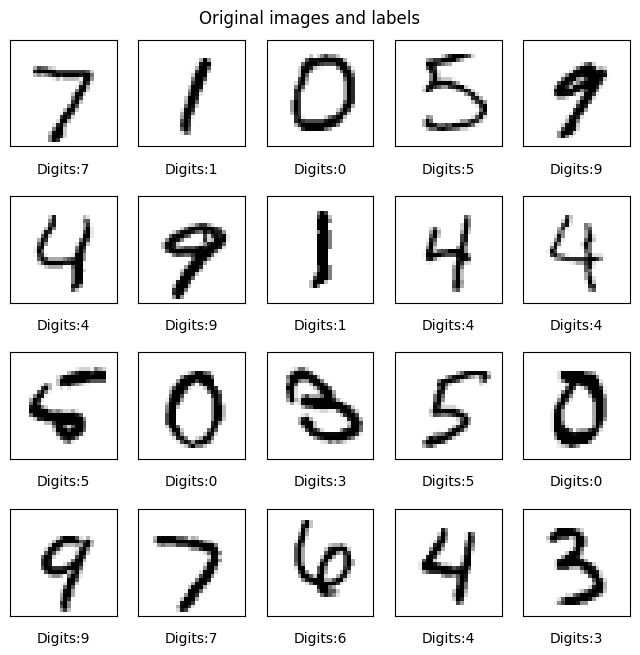

<h3 align=center> The neural network models and edge devices </h3>

### Establishment of TF Lite and IR model runtime environment

---

**Directory Name:  [Runtime Environment](https://github.com/PINetDalhousie/Group2---CSCI-6709/tree/main/Runtime%20environment)**

The files in the directory area are a comprehensive guide on setting up a Tensorflow Lite and OpenVINO IR model runtime environment on Raspberry Pi 3/4 hardware, utilizing the Intel® Neural Compute Stick 2. It outlines the steps necessary to install and configure the required software and hardware components. The guide is organized into the following sections:

+ Raspbian OS setup and hardware requirements

+ Installation of TensorFlow Lite

+ Installation and configuration of OpenVINO™ Runtime for Raspbian OS

+ Simulation of Raspberry Pi 3B using QEMU

By following this guide, users can efficiently establish the desired runtime environment and simulate the Raspberry Pi 3B with ease.

### Comparing CNN Model Performance: Raspberry Pi 4 vs. Intel NCS2

---

**Directory Name: [CNN_Model](https://github.com/PINetDalhousie/Group2---CSCI-6709/tree/main/CNN_Model)**

The goal of this experiment is to create various neural network models for the MNIST dataset using TensorFlow, and identify the optimal model through optimization and fine-tuning. The chosen model is then evaluated on a test dataset to produce a confusion matrix and a classification report.

Next, the top-performing model is converted into a TensorFlow Lite model and an OpenVINO IR model, and tested on hardware platforms such as Raspberry Pi 4B and Intel Neural Compute Stick 2. The models process the transformed test dataset and perform inference. Execution status and results are recorded in JSON format files, which are imported to generate visualizations.

Finally, all experimental results are analyzed and graphs are created to summarize the findings.

#### Data Augmentation

During the experiment, we observed that the MINST dataset is too regular, resulting in high model accuracy, which is not conducive to our performance comparison process. To address this issue, we applied appropriate data augmentation techniques, including increasing the image size, converting grayscale to RGB color, and adding random noise to the images using the Gaussian algorithm. The following images show the changes in the dataset before and after augmentation.

|  |  |
| ------------------------------------------------------------ | ------------------------------------------------------------ |

#### Model optimization via quantization

At the beginning of our experiment, we believed that the model we developed was complex enough and large enough. However, when we converted it into a format suitable for edge devices and ran it on a Raspberry Pi, we found that the model accuracy did not decrease, despite the limitations of the device's physical performance. Even if the model is quite large, the Raspberry Pi can use virtual memory by enabling swap space to ensure the model can run. However, using virtual memory can affect the model's performance since accessing the hard disk is slower than accessing memory. Therefore, we must balance model accuracy and latency and reduce the model size and inference latency as much as possible without compromising accuracy, using hardware accelerators whenever possible.

TensorFlow Lite currently supports optimization via quantization, pruning and clustering.

Quantization works by reducing the precision of the numbers used to represent a model's parameters, which by default are 32-bit floating point numbers. This results in a smaller model size and faster computation.

The following decision tree helps you select the quantization schemes you might want to use for your model, simply based on the expected model size and accuracy.

Reference:  <https://tensorflow.google.cn/lite/performance/model_optimization>

#### Experimental Results

The table below shows the results of the model running on Raspberry Pi under different quantization methods. The model adopts a CNN architecture in TFLite format with a total of 7,411,402 parameters.

| Type                   | No quantification | Quantization Aware Training | Float16 quantization | Dynamic range quantization | Full integer quantization |
| :--------------------- | :---------------- | :-------------------------- | :------------------- | :------------------------- | :------------------------ |
| Model Size             | 28.275 M          | 28.275 M                    | 14.140 M             | 7.078 M                    | 7.076 M                   |
| Accuracy               | 0.921             | 0.921                       | 0.921                | 0.9215                     | 0.9205                    |
| Inference time         | 88968.00 ms       | 93029.00 ms                 | 90144.00 ms          | 63662.00 ms                | 57614.00 ms               |
| Number of inferences   | 2000              | 2000                        | 2000                 | 2000                       | 2000                      |
| Average Inference time | 44.48 ms          | 46.51 ms                    | 45.07 ms             | 31.83 ms                   | 28.81 ms                  |
| Memory Usage           | 389.48 M          | 388.23 M                    | 322.96 M             | 354.94 M                   | 167.13 M                  |
| CPU Usage              | 60.23 %           | 60.96 %                     | 62.08 %              | 28.16 %                    | 25.13 %                   |

Memory and CPU usage during model inference.

The acceleration performance of intel neural computing stick2 on CNN models.

| Type                   | Raspberry Pi 4B | Accelerated with intel NCS2 |
| :--------------------- | :-------------: | :-------------------------: |
| Model Size             |    28.275 M     |          14.174 M           |
| Accuracy               |      0.921      |           0.9205            |
| Inference time         |   88968.00 ms   |         44061.00 ms         |
| Number of inferences   |      2000       |            2000             |
| Average Inference time |    44.48 ms     |          22.03 ms           |
| Memory Usage           |    389.48 M     |          410.52 M           |
| CPU Usage              |     60.23 %     |           5.14 %            |

Memory and CPU usage during model inference.

---
