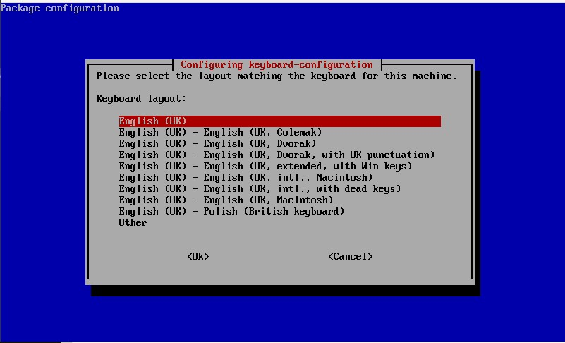
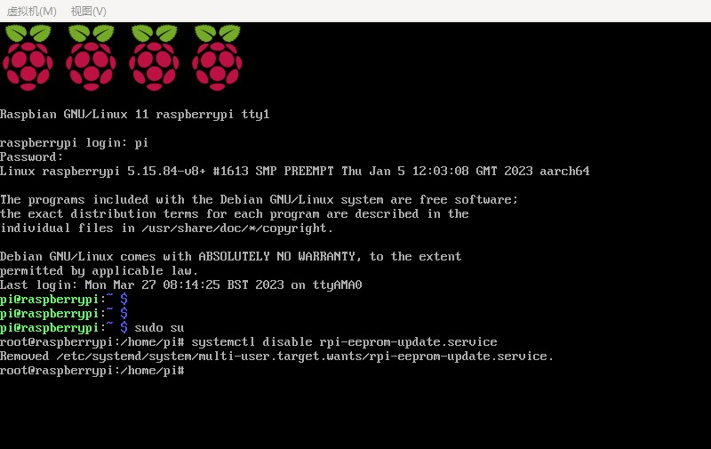
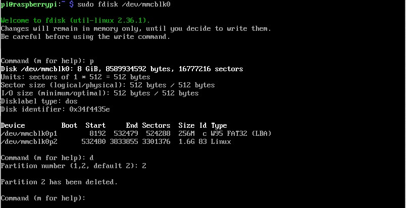
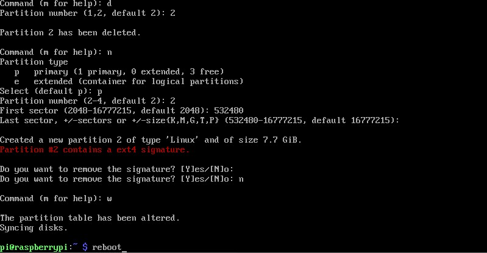
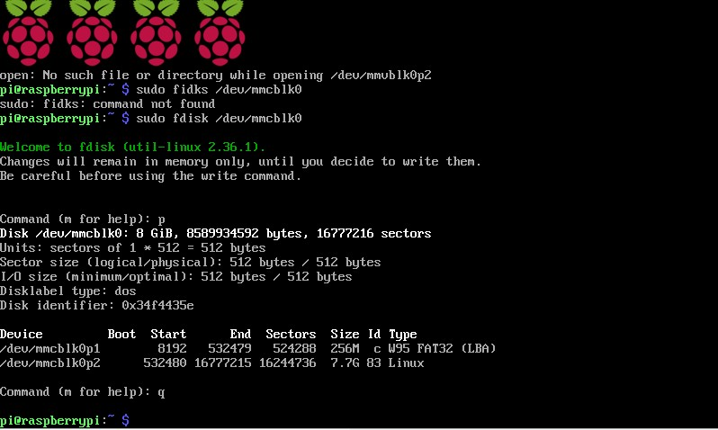
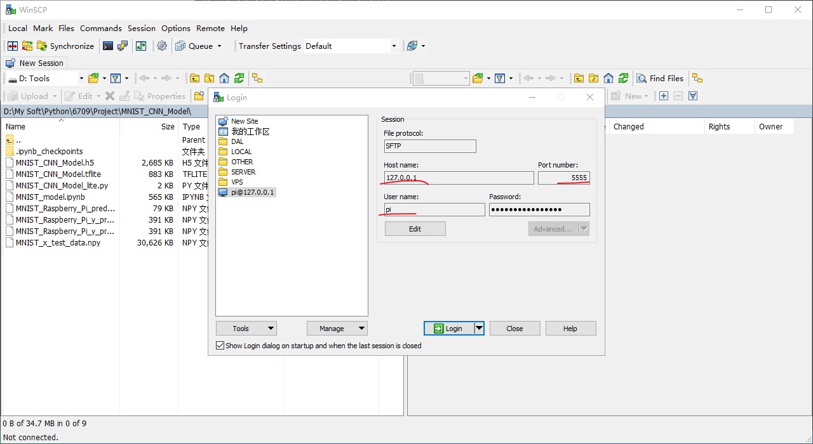

<h2  align="center">Establishment of Tensorflow Lite and OpenVINO IR model runtime environment</h2>

<h4 align="center">Hardware: Raspberry Pi 3/4 and Intel® Neural Compute Stick 2</h4>
<h4 align="center"> Simulation Raspberry Pi 3B</h4>

<p  align="center">Author: Yixiao Yuan</p>

<p  align="center">Apr 10,2023</p>

### Establishment of TF Lite and IR model runtime environment

#### 1. Raspbian OS

Hardware requirements: Raspberry Pi 3 or 4 and Intel® Neural Compute Stick 2

Operating system: Raspbian Buster, ARM, 32-bit or Raspbian Stretch, ARM, 32-bit

Raspberry Pi OS Lite :  [raspios_lite_armhf-2021-05-28](https://downloads.raspberrypi.org/raspios_lite_armhf/images/raspios_lite_armhf-2021-05-28/2021-05-07-raspios-buster-armhf-lite.zip)

#### 2. Install Tensorflow lite

```sh
sudo apt install python3-pip

echo "deb https://packages.cloud.google.com/apt coral-edgetpu-stable main" | sudo tee /etc/apt/sources.list.d/coral-edgetpu.list
curl https://packages.cloud.google.com/apt/doc/apt-key.gpg | sudo apt-key add -

sudo apt-get update
sudo apt-get install python3-tflite-runtime

pip3 install psutil 
```

Use the `sudo pip3 list` command to verify that the installed packages include `numpy` and `tflite-runtime`, and then you can successfully run the tflite model.

#### 3.  Install OpenVINO™ Runtime for Raspbian OS

Reference：<https://docs.openvino.ai/2022.2/openvino_docs_install_guides_overview.html>

##### 3.1 Download and Install OpenVINO Runtime

Create an installation folder for OpenVINO. If the folder already exists, skip this step.

```sh
sudo mkdir -p /opt/intel
```

Go to your ~/Downloads directory and download OpenVINO Runtime archive file

```sh
mkdir ~/Downloads/ 
cd ~/Downloads/

sudo wget https://storage.openvinotoolkit.org/repositories/openvino/packages/2022.2/linux/l_openvino_toolkit_debian9_arm_2022.2.0.7713.af16ea1d79a_armhf.tgz -O openvino_2022.2.0.7713.tgz
```

Extract the archive file and move it to the installation folder:

```sh
sudo tar -xf openvino_2022.2.0.7713.tgz

sudo mv l_openvino_toolkit_debian9_arm_2022.2.0.7713.af16ea1d79a_armhf /opt/intel/openvino_2022.2
```

Install required system dependencies on Linux.

```sh
cd /opt/intel

sudo ln -s openvino_2022.2 openvino_2022

sudo apt install cmake
```

##### 3.2 Configurations for Intel® Neural Compute Stick 2

Add the current Linux user to the users group:

```sh
sudo usermod -a -G users "$(whoami)"
```

If you didn’t modify `.bashrc` to permanently set the environment variables, run `setupvars.sh` again after logging in:

```sh
source /opt/intel/openvino_2022/setupvars.sh
```

To perform inference on the Intel® Neural Compute Stick 2, install the USB rules running the `install_NCS_udev_rules.sh` script:

```sh
cd /opt/intel/openvino_2022/install_dependencies

./install_NCS_udev_rules.sh
```

Plug in your Intel® Neural Compute Stick 2.

##### 3.3 Set the Environment Variables

```sh
cd ~

source /opt/intel/openvino_2022/setupvars.sh
```

**The above command (`source /opt/intel/openvino_2022/setupvars.sh` )must be re-run every time you start a new terminal session.** you will see `[setupvars.sh] OpenVINO environment initialized.`, and here we can happily run the OpenVINO IR model.

**To set up Linux to automatically run the command every time a new terminal is opened, open `~/.bashrc` in your favorite editor and add `source /opt/intel/openvino_2022/setupvars.sh` after the last line. Next time when you open a terminal, you will see `[setupvars.sh] OpenVINO™ environment initialized`.** Changing `.bashrc` is not recommended when you have multiple OpenVINO versions on your machine and want to switch among them.

##### 3.4. Test runtime environment and drivers

Restart the system and execute `source /opt/intel/openvino_2022/setupvars.sh`, then proceed with the following Python code:

```python
import openvino.inference_engine as IECore
 
engine = IECore.IECore()
 
print(engine.available_devices)
```

The output is: ['CPU', 'MYRIAD'], indicating that the runtime environment and the corresponding driver have been successfully installed.

---

### Simulation Raspberry Pi 3B

#### 1.  Install QEMU

QEMU is an open-source emulator and virtualizer that allows users to simulate various hardware architectures on a host machine. It is widely used for testing and development purposes, as well as for running legacy software or operating systems on modern hardware. QEMU can simulate a wide range of architectures, including x86, ARM, MIPS, PowerPC, and more. It can also emulate various devices, such as graphics cards, network cards, and USB devices, making it a versatile tool for developers and researchers.

QEMU is known for its high performance and reliability, and it has been used in various industries, such as aerospace, automotive, and telecommunications. It supports various operating systems, including Linux, Windows, and macOS, and it can run on various hardware platforms, including x86, ARM, and PowerPC.

QEMU is licensed under the GNU General Public License (GPL) version 2 or later, which means that it is free and open-source software. This allows users to modify and distribute QEMU as they see fit, making it a popular choice for hobbyists, researchers, and open-source developers.

To learn more about QEMU, you can visit the official website at <https://www.qemu.org/>.

**Installation steps for QEMU 7.2.0:**

1. Download [https://qemu.weilnetz.de/w64/qemu-w64-setup-20221230.exe](https://qemu.weilnetz.de/w64/qemu-w64-setup-20221230.exe)

2. Install QEMU 7.2.0 and Add the QEMU installation path to the system path.

#### 2. Use QEMU to simulate the Raspberry Pi 3B

1. Download 32-bit Raspberry Pi OS Lite  from the official website :  [raspios_lite_armhf-2021-05-28](https://downloads.raspberrypi.org/raspios_lite_armhf/images/raspios_lite_armhf-2021-05-28/2021-05-07-raspios-buster-armhf-lite.zip)
2. Use 7zip to extract the `2021-05-07-raspios-buster-armhf-lite.zip` file, which will result in the `2021-05-07-raspios-buster-armhf-lite.img` file.
3. Use 7zip again to extract the `2021-05-07-raspios-buster-armhf-lite.img` file, which will generate two files, `1.img` and `0.fat`.
4. Use 7zip once more to extract the `0.fat` file.
5. Copy the following files, `2021-05-07-raspios-buster-armhf-lite.img`, `kernel8.img`, and `bcm2710-rpi-3-b.dtb`, into the same directory.
6. Use the following command to modify the size of the Raspberry Pi img file size to 8G, which is equivalent to using an 8G TF card when emulating the system.

```sh
qemu-img resize -f raw 2021-05-07-raspios-buster-armhf-lite.img 8G
```

7. Boot Raspberry Pi image files with qemu-system-aarch64 command.

```bat
qemu-system-aarch64 -M raspi3b -append "rw earlyprintk loglevel=8 console=ttyAMA0,115200 dwc_otg.lpm_enable=0 root=/dev/mmcblk0p2 rootdelay=1" -dtb bcm2710-rpi-3-b.dtb -drive file=2021-05-07-raspios-buster-armhf-lite.img,format=raw -kernel kernel8.img -m 1G -smp 4 -serial stdio -netdev user,id=net0,hostfwd=tcp::5555-:22  -usb -device usb-kbd -device usb-tablet  -device usb-net,netdev=net0
```

8. After startup, the system setup window appears, set the user name and password to log in to the system.

<div align=center></div>

<div align=center></div>

9. Raspberry Pi extended root root partition

   ```sh
   sudo fdisk /dev/mmcblk0
   ```

<div align=center></div>

<div align=center></div>

```sh
sudo resize2fs /dev/mmcblk0p2
```

<div align=center></div>

9. The Raspberry Pi SSH service is automatically started on boot, You can reinitialize ssh with the following command:

   ```sh
   sudo systemctl enable ssh
   sudo systemctl start ssh
   sudo reboot
   ```

   Use ssh client software, such as winscp, to configure the ip, port, username and password, and then you can upload and download files.

<div align=center></div>
